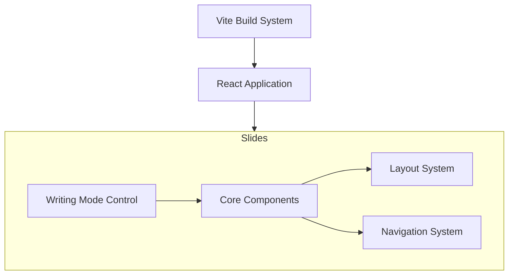

# System Patterns

## Architecture Overview



## Core Components

### Presentation System

- Vite for build and development
- React for UI components
- TypeScript for type safety
- Writing mode control system

### Slide Components

- `Layout.tsx`: Layout management system
- `Slide.tsx`: Container component
- CSS custom properties for writing modes

## Design Patterns

### Component Architecture

- Writing mode aware layouts
- Container-based responsive design
- Print media optimization

### System Organization

- Core component separation
- Layout system isolation
- Writing mode abstraction

### Development Patterns

- TypeScript for type safety
- CSS container queries for responsive layouts
- CSS custom properties for dynamic writing modes
- Scroll snap for slide navigation
- IntersectionObserver for slide tracking

## File Structure

```
src/
├── slide-components/    # Core slide components
│   ├── Layout.tsx      # Layout system
│   └── Slide.tsx       # Slide container
├── App.tsx             # Application core
├── vite-plugin-slides.ts # Slide processing
└── *.css              # Core styles

slides/               # Content directory (not part of core system)
```

## Technical Decisions

1. **Writing Mode Control**

   - CSS custom properties for global mode control
   - Container queries for layout adaptation
   - Print-specific writing mode handling

2. **Navigation System**

   - Scroll snap for slide alignment
   - IntersectionObserver for slide tracking
   - Keyboard and wheel event handling
   - Hash-based slide identification

3. **Layout Components**

   - Modular layout system
   - Writing mode responsive designs
   - Print-optimized structure

4. **CSS Architecture**
   - Container queries for dimensions
   - Custom properties for dynamic modes
   - Print media optimization
   - Logical properties usage
